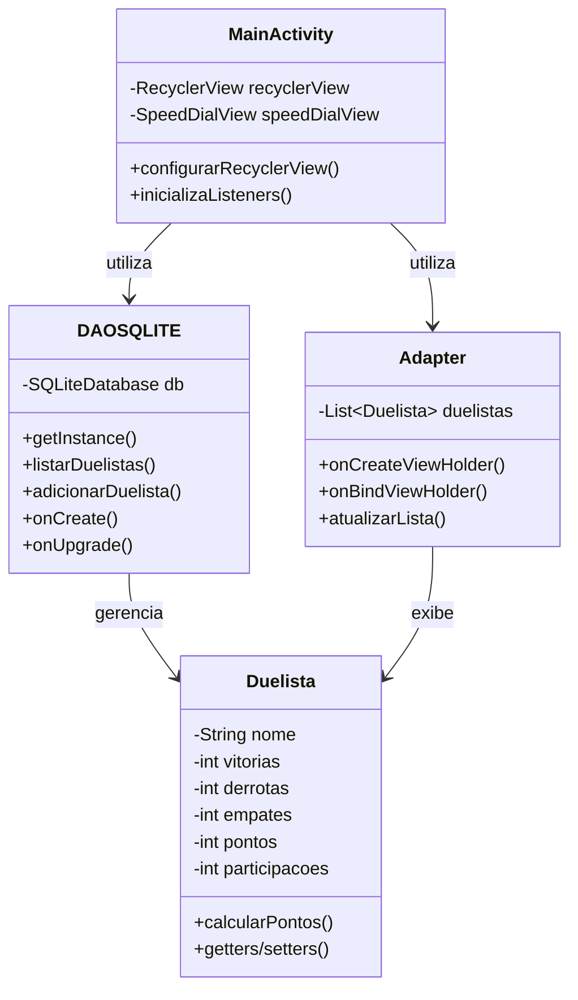

# 🏆 TournamentManager

<div align="center">


**Sistema de Gerenciamento de Torneios para Android**

[Sobre](#-sobre) • [Funcionalidades](#-funcionalidades) • [Tecnologias](#-tecnologias) • [Arquitetura](#-arquitetura) • [Como Executar](#-como-executar)

</div>

---

## 📖 Sobre

TournamentManager é uma aplicação Android desenvolvida para gerenciar torneios e competições, permitindo o cadastro de participantes (duelistas), registro de resultados e acompanhamento de classificações em tempo real.

O sistema implementa um **sistema de pontuação automático**, onde:
- **Vitória** = 3 pontos
- **Empate** = 1 ponto
- **Derrota** = 0 pontos
- **Participação** = Bônus adicional

### 🎯 Objetivo

Facilitar a organização de torneios com ranking dinâmico, eliminando a necessidade de cálculos manuais e proporcionando uma interface intuitiva para gerenciamento de competições.

---

## ✨ Funcionalidades

- ✅ **Cadastro de Duelistas**: Adicione participantes ao torneio
- ✅ **Registro de Resultados**: Vitórias, derrotas e empates
- ✅ **Cálculo Automático de Pontos**: Sistema de pontuação configurável
- ✅ **Ranking em Tempo Real**: Classificação ordenada por pontuação
- ✅ **Persistência de Dados**: Armazenamento local com SQLite
- ✅ **Interface Responsiva**: Design Material com RecyclerView
- ✅ **Menu de Ações Rápidas**: SpeedDial para CRUD de duelistas

---

## 🛠 Tecnologias

### Core
- **Java** - Linguagem principal
- **Android SDK** - Framework mobile
- **Gradle (Kotlin DSL)** - Sistema de build

### Banco de Dados
- **SQLite** - Banco de dados local
- **DAO Pattern** - Camada de abstração de dados
- **Singleton Pattern** - Gerenciamento de instância do banco

### UI/UX
- **RecyclerView** - Listagem eficiente de duelistas
- **Material Design** - Guidelines de design do Android
- **SpeedDialView** - Menu flutuante de ações ([leinardi/FloatingActionButtonSpeedDial](https://github.com/leinardi/FloatingActionButtonSpeedDial))

---

## 🏗 Arquitetura

O projeto segue uma arquitetura em camadas com separação de responsabilidades:

```
app/
├── model/              # Camada de Modelo
│   └── Duelista.java   # Entidade principal
├── dao/                # Camada de Acesso a Dados
│   └── DAOSQLITE.java  # SQLite Helper + DAO
├── adapter/            # Camada de Apresentação
│   └── Adapter.java    # RecyclerView Adapter
└── views/              # Camada de Interface
    └── MainActivity.java
```

### 📊 Diagrama de Classes



### 🗄️ Estrutura do Banco de Dados

**Tabela: Duelistas**
| Campo | Tipo | Descrição |
|-------|------|-----------|
| id | INTEGER (PK) | Identificador único |
| nome | TEXT | Nome do duelista |
| vitorias | INTEGER | Número de vitórias |
| derrotas | INTEGER | Número de derrotas |
| empates | INTEGER | Número de empates |
| participacoes | INTEGER | Número de participações |
| pontos | INTEGER | Pontuação total calculada |

---

## 🚀 Como Executar

### Pré-requisitos

- **Android Studio** (versão mais recente)
- **JDK 8+**
- **Android SDK** (API Level 21+)
- **Dispositivo/Emulador Android**

### Passo a Passo

1. **Clone o repositório**
```bash
git clone https://github.com/Luan-Diniz02/TournamentManager.git
cd TournamentManager
```

2. **Abra no Android Studio**
```
File > Open > Selecione a pasta do projeto
```

3. **Sincronize o Gradle**
```
O Android Studio fará automaticamente ou clique em "Sync Now"
```

4. **Execute o aplicativo**
```
Run > Run 'app' (Shift + F10)
```

### Build via Linha de Comando

```bash
# Debug build
./gradlew assembleDebug

# Release build
./gradlew assembleRelease

# Executar testes
./gradlew test
```

---

## 🔄 Roadmap

- [ ] Implementar funcionalidade de edição de duelistas
- [ ] Adicionar funcionalidade de remoção com confirmação
- [ ] Criar tela de histórico de partidas
- [ ] Implementar sistema de gerenciamento de múltiplos torneios
- [ ] Adicionar exportação de dados (CSV/PDF)
- [ ] Implementar gráficos de estatísticas
- [ ] Adicionar tema escuro
- [ ] Implementar testes unitários e de integração

---

## 🤝 Contribuindo

Contribuições são bem-vindas! Sinta-se à vontade para:

1. Fazer um fork do projeto
2. Criar uma branch para sua feature (`git checkout -b feature/AmazingFeature`)
3. Commit suas mudanças (`git commit -m 'Add some AmazingFeature'`)
4. Push para a branch (`git push origin feature/AmazingFeature`)
5. Abrir um Pull Request

---

## 👨‍💻 Autor

**Luan Diniz**

- GitHub: [@Luan-Diniz02](https://github.com/Luan-Diniz02)

---

## 📄 Licença

Este projeto é de código aberto e está disponível para fins educacionais.

---

## 🙏 Agradecimentos

- [Android Developers](https://developer.android.com/) - Documentação oficial
- [leinardi/FloatingActionButtonSpeedDial](https://github.com/leinardi/FloatingActionButtonSpeedDial) - Biblioteca SpeedDial
- Comunidade Android Brasil

---

<div align="center">

**⭐ Se este projeto foi útil, considere dar uma estrela!**

</div>